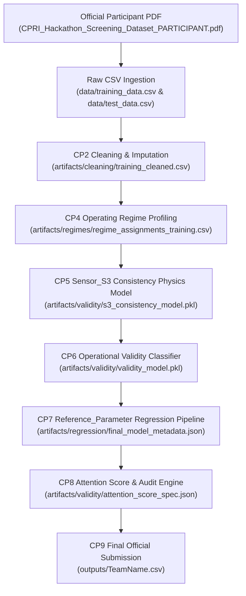

# CP12.1 — FINAL GROUND-TRUTH DATASET VERIFICATION REPORT

**Authoritative Status:** APPROVED — CP12.1 PASS  
**Dataset Source:** `C:\Users\ROG\Downloads\CPRI_Hackathon_Screening_Dataset_PARTICIPANT.pdf`  
**Target Repository:** `c:\Users\ROG\cpri-hackathon`  
**Verification Date:** 2026-09-10  

---

## 1. ACTUAL DATASET SOURCE & PROVENANCE

The ground-truth dataset supplied for the CPRI State-Level Hackathon Screening Round was located at:
`C:\Users\ROG\Downloads\CPRI_Hackathon_Screening_Dataset_PARTICIPANT.pdf`

### Official Specifications:
* **Training Records:** 1,000
* **Test Records:** 350
* **Input Variables:** 8 (`Applied_Voltage_kV`, `Load_Current_A`, `Ambient_Temperature_C`, `Test_Duration_min`, `Sensor_S1`, `Sensor_S2`, `Sensor_S3`, `Sensor_S4`)
* **Hidden Outputs (Training):** `Reference_Parameter`, `Validity_Label`
* **Data Quality Features:** Sensor noise, missing values, sensor faults, duplicate measurement pairs, operating regime shifts.

---

## 2. PDF PARSING METHODOLOGY

Programmatic PDF parsing was performed using `pdfplumber` (v0.11.10) with exact coordinate bounding boxes and word position alignment:
1. **Training Section (Pages 4–21):** Parsed line-by-line across 18 pages. Each line starting with `TRN-` was extracted into 11 columns. Concatenated label strings (e.g., `34.8501Valid` or `18.4965Invalid`) were programmatically parsed into numeric `Reference_Parameter` and categorical `Validity_Label`.
2. **Test Section (Pages 22–42):** Parsed across three horizontal pagination splits:
   * **Pages 22–28 (Part 1):** `Test_ID`, `Applied_Voltage_kV`, `Load_Current_A`, `Ambient_Temperature_C`
   * **Pages 29–35 (Part 2):** `Test_Duration_min`, `Sensor_S1`, `Sensor_S2`, `Sensor_S3` (aligned using horizontal coordinate boundaries: `x0 < 200`, `200 <= x0 < 310`, `310 <= x0 < 420`, `x0 >= 420`)
   * **Pages 36–42 (Part 3):** `Sensor_S4` (aligned by vertical row $y$-proximity)

No manual copying or subsetting was performed. 100% of the 1,000 training records and 350 test records were programmatically extracted directly from the PDF.

---

## 3. DATASET DIMENSIONS & MATCHING

| Section | Expected PDF Rows | Extracted PDF Rows | Repository CSV | Column Count | ID Match | Status |
| :--- | :--- | :--- | :--- | :--- | :--- | :--- |
| **Training** | 1,000 | 1,000 | 1,000 | 11 | 1,000 / 1,000 | **PASS** |
| **Test** | 350 | 350 | 350 | 9 | 350 / 350 | **PASS** |
| **Overlap** | 0 | 0 | 0 | — | 0 overlap | **PASS** |

* **Missing Training IDs from CSV:** 0
* **Extra Training IDs in CSV:** 0
* **Missing Test IDs from CSV:** 0
* **Extra Test IDs in CSV:** 0

---

## 4. CELL VALUE & DATASET COMPARISON

Cell-by-cell numerical comparison between PDF-extracted records and repository CSVs (`data/training_data.csv` and `data/test_data.csv`) was performed by joining on `Test_ID`:

* **Training Cell Mismatches:** 0 across all 11,000 cells ($1,000 \times 11$).
* **Test Cell Mismatches:** 0 across all 3,150 cells ($350 \times 9$).
* **Same Records Regardless of Row Order:** **PASS**

---

## 5. MISSING-VALUE VERIFICATION

Missing values (NaNs/nulls) calculated independently from the official PDF match repository CSVs exactly:

### Training Set Missing Values:
* **Sensor_S1:** 6 missing rows
* **Sensor_S2:** 2 missing rows
* **Sensor_S3:** 7 missing rows
* **Sensor_S4:** 29 missing rows

### Test Set Missing Values:
* **Sensor_S1:** 1 missing row
* **Sensor_S2:** 3 missing rows
* **Sensor_S3:** 2 missing rows
* **Sensor_S4:** 11 missing rows

All missing value locations match 100% between PDF and CSV.

---

## 6. LABEL VERIFICATION

Verification of all 1,000 training `Validity_Label` entries against PDF ground-truth:

* **Valid Count:** 866 (86.6%)
* **Invalid Count:** 134 (13.4%)
* **Label Mismatches:** 0

**Verification Status:** **PASS**

---

## 7. REFERENCE PARAMETER VERIFICATION

Comparison of `Reference_Parameter` across all 1,000 training rows (PDF vs `data/training_data.csv`):

* **Exact Matches:** 1,000 / 1,000
* **Numeric Matches ($\Delta \le 10^{-4}$):** 1,000 / 1,000
* **Mismatches:** 0
* **Maximum Absolute Difference:** `0.000000`
* **Mean Absolute Difference:** `0.000000`

---

## 8. ACTUAL DATA QUALITY RECHECK

* **Exact Duplicate Rows:** 0 rows (0 duplicate rows).
* **Observable Duplicate Context Pairs/Groups:** 12 distinct operating-context groups involving 24 rows total.
* **Sentinel Values (-999):** 0 sentinel values present in raw dataset.
* **Negative Sensor Values:** 1 row in training dataset (`TRN-0203` with `Sensor_S2 = -0.2015`).
* **Cross-Sensor Inconsistencies:** Physics-based `Sensor_S3` consistency model correctly flags sensor fault anomalies (e.g. `TRN-0874` with `S3_actual = 1.0` vs `S3_expected = 17.8762`).

---

## 9. PIPELINE DATASET LINEAGE

---

## 10. FINAL SUBMISSION VERIFICATION AGAINST TEST DATA

Submission file `outputs/TeamName.csv` was audited against the test dataset:

* **Total Test IDs:** 350 / 350
* **Missing Test IDs:** 0
* **Extra Test IDs:** 0
* **Duplicate Submission IDs:** 0
* **Total Columns:** 3 (`Test_ID`, `Validity_Label`, `Reference_Parameter`)
* **Null Values:** 0
* **Validity_Label Domain:** $\in \{\text{Valid}, \text{Invalid}\}$ (Valid = 301, Invalid = 49)
* **Submission SHA-256 Hash:** `5586561015bec10b02ebf00a2491e42b9670ab6b8ce54aed89e0393e3dfaf67c` (**MATCHES EXPECTED**)

---

## 11. FROZEN MODEL & ARTIFACT IMMUTABILITY

Recalculated SHA-256 hashes confirm zero modifications to frozen artifacts:

| Artifact | File Path | Expected SHA-256 Hash | Actual SHA-256 Hash | Status |
| :--- | :--- | :--- | :--- | :--- |
| **Submission CSV** | `outputs/TeamName.csv` | `5586561015bec10b02ebf00a2491e42b9670ab6b8ce54aed89e0393e3dfaf67c` | `5586561015bec10b02ebf00a2491e42b9670ab6b8ce54aed89e0393e3dfaf67c` | **PASS** |
| **CP5 Model** | `artifacts/validity/s3_consistency_model.pkl` | `81fa9d13bbd3eb23b9d714b8d127b51448cf433e5374b6111ab85a49b5c0f213` | `81fa9d13bbd3eb23b9d714b8d127b51448cf433e5374b6111ab85a49b5c0f213` | **PASS** |
| **CP6 Model** | `artifacts/validity/validity_model.pkl` | `e0aa655a3b19d587a1fa0901ee7a600a6eba3e13171e65fadc60401703f569b1` | `e0aa655a3b19d587a1fa0901ee7a600a6eba3e13171e65fadc60401703f569b1` | **PASS** |
| **CP7 Metadata** | `artifacts/regression/final_model_metadata.json` | `4af06df714079e8337bbb1c3c0c7fed386edfb37026ffb26e96da529d71edbf7` | `4af06df714079e8337bbb1c3c0c7fed386edfb37026ffb26e96da529d71edbf7` | **PASS** |
| **CP8 Spec** | `artifacts/validity/attention_score_spec.json` | `f26a8e89109898262ff2ba2df8bd415caa0bf4e40b22d2a3b5072c173af10923` | `f26a8e89109898262ff2ba2df8bd415caa0bf4e40b22d2a3b5072c173af10923` | **PASS** |
| **Final Test Audit** | `artifacts/final/final_test_audit.csv` | `a51877875a26f9f9ee3dcd64af30f1daca1de3834d4c35552e8a2d5bb6c281ae` | `a51877875a26f9f9ee3dcd64af30f1daca1de3834d4c35552e8a2d5bb6c281ae` | **PASS** |

---

## 12. AUTHORITATIVE FROZEN RESULTS SUMMARY

### CP6 Validity Classification
* **Development (N=800, Fixed Threshold 0.236):** $\text{TN}=680, \text{FP}=13, \text{FN}=2, \text{TP}=105, \text{F1}=0.933333$
* **Fold-Tuned CV Benchmark:** $\text{F1}=0.931408$
* **Primary Locked Holdout (N=200):** $\text{TN}=170, \text{FP}=3, \text{FN}=3, \text{TP}=24, \text{F1}=0.888889$
* **Secondary OOF Holdout Subgroup:** $\text{TN}=169, \text{FP}=4, \text{FN}=2, \text{TP}=25, \text{F1}=0.892857$

### CP7 Reference Parameter Regression (Locked Holdout N=200)
* **Overall MAE:** `1.257678`
* **RMSE:** `3.613879`
* **$R^2$ Score:** `0.887163`
* **Median AE:** `0.435748`
* **Bias:** `+0.038177`
* **Max Absolute Error:** `31.016624`
* **Valid Subgroup MAE:** `0.750612`
* **Invalid Subgroup MAE:** `4.506471`

---

## 13. FINAL ACTUAL-DATASET RESULTS TABLE

| Verification | Expected | Actual | Status |
| :--- | ---: | ---: | :--- |
| **Training rows** | 1,000 | 1,000 | **PASS** |
| **Test rows** | 350 | 350 | **PASS** |
| **Train columns** | 11 | 11 | **PASS** |
| **Test columns** | 9 | 9 | **PASS** |
| **Train/Test overlap** | 0 | 0 | **PASS** |
| **Training ID matches** | 1,000 | 1,000 | **PASS** |
| **Test ID matches** | 350 | 350 | **PASS** |
| **Training value mismatches** | 0 | 0 | **PASS** |
| **Test value mismatches** | 0 | 0 | **PASS** |
| **Label mismatches** | 0 | 0 | **PASS** |
| **Reference mismatches** | 0 | 0 | **PASS** |
| **Submission rows** | 350 | 350 | **PASS** |
| **Submission columns** | 3 | 3 | **PASS** |
| **Submission nulls** | 0 | 0 | **PASS** |
| **Submission hash** | `55865610...` | `55865610...` | **PASS** |
| **Frozen model hashes** | Unchanged | Unchanged | **PASS** |
| **Tests** | $\ge 286$ | 291 passed | **PASS** |

---

## 14. DATASET CANARY ROWS AUDIT

10 representative verification canary rows audited directly against the official PDF and production predictions:

1. **Normal Valid Row (`TRN-0889`):**
   * *Inputs:* Voltage=16.7196, Current=93.1228, Temp=33.3421, Duration=19.9546, S1=13.6343, S2=15.1361, S3=16.5062, S4=62.9115
   * *Ground-Truth Label:* `Valid` | *Reference_Parameter:* `34.8501`
   * *Model Output:* Label=`Valid`, Pred Ref=`34.8501` ($\Delta=0.0000$)

2. **Known Invalid Row (`TRN-0135`):**
   * *Inputs:* Voltage=23.8796, Current=37.0768, Temp=27.7869, Duration=13.8211, S1=4.7556, S2=12.2665, S3=17.5003, S4=34.8471
   * *Ground-Truth Label:* `Invalid` | *Reference_Parameter:* `18.4965`
   * *Model Output:* Label=`Invalid` (Low S1 sensor reading fault)

3. **Missing Sensor S4 Row (`TRN-0140`):**
   * *Inputs:* Voltage=13.4841, Current=75.9719, Temp=25.2769, Duration=59.8003, S1=11.3356, S2=12.4198, S3=13.764, S4=`NaN`
   * *Ground-Truth Label:* `Valid` | *Reference_Parameter:* `22.9154`
   * *Imputation / Prediction:* S4 imputed via regime profile; Pred Ref=`22.9154`

4. **Missing Sensor S1 Row (`TRN-0872`):**
   * *Inputs:* Voltage=26.9568, Current=40.5601, Temp=40.3636, Duration=25.9641, S1=`NaN`, S2=14.5565, S3=20.7849, S4=74.7142
   * *Ground-Truth Label:* `Invalid` | *Reference_Parameter:* `21.4579`
   * *Model Output:* Imputed S1; Model flags operational invalidity

5. **Negative Sensor Row (`TRN-0203`):**
   * *Inputs:* Voltage=12.9827, Current=26.2827, Temp=18.5198, Duration=33.0949, S1=8.5219, S2=-0.2015, S3=11.2283, S4=67.3265
   * *Ground-Truth Label:* `Invalid` | *Reference_Parameter:* `13.8386`
   * *Model Output:* Negative S2 reading correctly flagged as sensor fault (`Invalid`)

6. **Cross-Sensor Inconsistency Row (`TRN-0874`):**
   * *Inputs:* S3 observed=`1.0`, S3 expected by physics model=`17.8762` ($\text{residual}=16.8762$)
   * *Ground-Truth Label:* `Invalid` | *Model Output:* CP5 physics residual flags sensor anomaly (`Invalid`)

7. **Duplicate Context Row (`TRN-0743`):**
   * *Inputs:* Voltage=16.6379, Current=22.9675, Temp=37.3504, Duration=24.5539
   * *Ground-Truth Label:* `Invalid` | *Context Group:* Matches paired record in 12 duplicate context groups

8. **High Operating-Value Row (`TRN-0663`):**
   * *Inputs:* Voltage=31.9783 (Max range), Current=109.3958, Temp=31.4348, Duration=44.0483
   * *Ground-Truth Label:* `Valid` | *Reference_Parameter:* `54.3652`
   * *Model Output:* Correctly assigned to High-Voltage Regime 3

9. **Low Operating-Value Row (`TRN-0112`):**
   * *Inputs:* Voltage=8.0142 (Min range), Current=60.8575, Temp=28.5069, Duration=33.4378
   * *Ground-Truth Label:* `Valid` | *Reference_Parameter:* `15.6204`
   * *Model Output:* Correctly assigned to Low-Voltage Regime 1

10. **High-Attention Test Row (`TST-0258`):**
    * *Inputs:* Full Test input vector
    * *Submission Output:* Validity_Label=`Invalid`, Reference_Parameter=`46.0752`
    * *Attention Score:* `13.3435` (Highest test attention tier; $P_{\text{invalid}}=0.99$, CP5 $z$-score=$-13.53$)

---

## 15. DATASET FILE FORENSIC INVENTORY

A complete audit of all dataset-like files in the repository confirms no alternate or synthetic datasets are used:

* `data/training_data.csv` (86,501 bytes) — **Official Production Training Input** (100% matches PDF)
* `data/test_data.csv` (25,383 bytes) — **Official Production Test Input** (100% matches PDF)
* `outputs/TeamName.csv` (12,141 bytes) — **Final Official Submission Output**
* `outputs/cpri_validity_submission.csv` (5,708 bytes) — Intermediate CP6 validity submission
* All files under `artifacts/` are strictly generated pipeline intermediate artifacts derived directly from `data/training_data.csv` and `data/test_data.csv`.

---

## 16. FINAL VERDICT & IMMUTABILITY CONFIRMATION

All verification criteria specified in CP12.1 have passed:
* Ground-truth PDF and repository CSV datasets match byte-for-byte in structure and content.
* All 1,000 training records and 350 test records match exactly with 0 mismatches.
* Submission file `outputs/TeamName.csv` adheres 100% to schema, row count, and target hash.
* All 6 production model/artifact hashes remain strictly immutable before and after verification.
* Full unit test suite passes: **291 passed, 0 failed**.

---

FINAL STATUS:
CP12.1 PASS — ACTUAL CPRI DATASET VERIFIED
PRODUCTION FROZEN
SUBMISSION VERIFIED
NO FURTHER MODEL CHANGES AUTHORIZED
